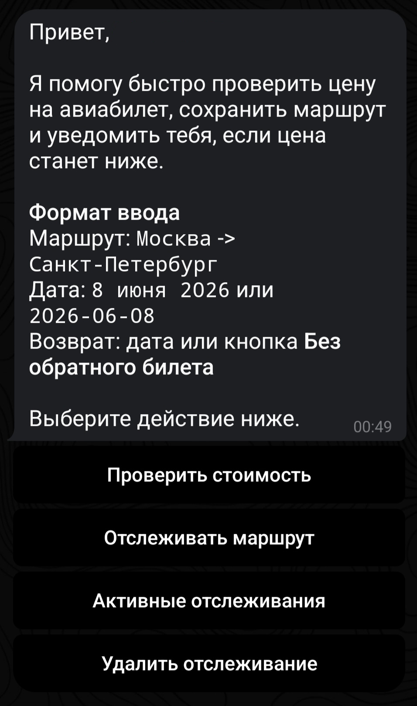

# JetPing

Telegram-бот для проверки и отслеживания цен на авиабилеты по маршруту и датам.

Текущая версия умеет принимать параметры поиска через Telegram, получать цену из Aviasales Data API через Travelpayouts, сохранять историю успешных поисков в SQLite, управлять активными отслеживаниями и автоматически проверять их в фоне.

Подробно про реальный API: [REAL_API.md](REAL_API.md)  
Подробно про БД: [database.md](database.md)

## Возможности

- Главное меню `/start` с inline-кнопками для основных действий.
- Команда `/price` для ручной проверки цены.
- Команда `/track` для сохранения маршрута на отслеживание.
- Команда `/list` для просмотра активных отслеживаний.
- Команда `/delete` для удаления отслеживания.
- Фоновая проверка активных отслеживаний.
- Уведомление пользователю, если новая цена ниже предыдущей.
- Ввод маршрута обычными названиями городов, например `Москва` -> `Санкт-Петербург` или `Нью-Йорк`, с сохранением поддержки IATA-кодов.
- Единственный источник реальных цен: Travelpayouts / Aviasales API.
- Сохранение успешных поисков и активных отслеживаний в SQLite.
- CLI-проверка источника цен без запуска Telegram.

## Стек

- Python
- python-telegram-bot
- requests
- python-dotenv
- SQLite через стандартный модуль `sqlite3`
- asyncio background task для scheduler

## Запуск

```powershell
python -m venv .venv
.\.venv\Scripts\activate
python -m pip install -r requirements.txt
```

Создайте файл `.env` в корне проекта и заполните его.

Если PowerShell блокирует активацию `.venv`, можно запускать Python напрямую:

```powershell
.\.venv\Scripts\python.exe main.py
```

## Конфигурация `.env`

Минимальная конфигурация для реального запуска через Travelpayouts / Aviasales API:

```env
TELEGRAM_BOT_TOKEN=telegram_bot_token_from_botfather
TRAVELPAYOUTS_TOKEN=your_travelpayouts_token
JETPING_CURRENCY=rub
JETPING_MARKET=ru
JETPING_DATABASE_PATH=data/jetping.db
JETPING_SCHEDULER_TICK_SECONDS=60
```


## Запуск бота

```powershell
python main.py
```

После запуска откройте бота в Telegram и отправьте:

```text
/start
```

При запуске бот также запускает фоновый scheduler. Он периодически выбирает активные отслеживания, которым пора выполнить проверку.

## Внешний вид главного меню



## Команды бота

- `/start` - главное меню с кнопками.
- `/help` - подсказка по формату ввода.
- `/price` - проверить текущую цену один раз.
- `/track` - сохранить маршрут для отслеживания.
- `/list` - показать активные отслеживания.
- `/delete <id>` - удалить отслеживание по ID.
- `/cancel` - отменить текущий ввод.

## Разовая проверка цены

Команда:

```text
/price
```

Бот последовательно запросит:

1. Город вылета, например `Москва` или `MOW`.
2. Город прилета, например `Санкт-Петербург` или `LED`.
3. Дату вылета, например `8 июня 2026`, `08.06.2026` или `2026-06-08`.
4. Дату возвращения в том же формате или кнопку `Без обратного билета`.

После успешного поиска результат сохраняется в таблицу `searches`.

Если города нет в локальном словаре, бот обращается к Travelpayouts / Aviasales Autocomplete API и получает подходящий IATA-код автоматически.
После ввода города бот показывает найденный вариант и просит подтвердить его кнопками `Да` / `Нет`.

## Создание отслеживания

Команда:

```text
/track
```

Бот запросит маршрут, даты и интервал проверки. Можно ввести любое положительное число минут:

- `1` - проверять раз в 1 минуту;
- `5` - проверять раз в 5 минут;
- `10` - проверять раз в 10 минут;
- `30` - проверять раз в 30 минут;
- `60` - проверять раз в 1 час.

Также поддерживаются текстовые варианты: `1 час`, `10 часов`, `24 часа`, `сутки`.

При создании отслеживания бот сразу проверяет текущую цену и сохраняет ее как `last_price` в таблице `tracked_routes`.

## Автоматическая проверка

Scheduler работает внутри процесса бота как `asyncio` background task.

Алгоритм:

1. Раз в `JETPING_SCHEDULER_TICK_SECONDS` секунд бот ищет активные маршруты, которым пора провериться.
2. Для каждого маршрута получает новую цену через текущий `PriceProvider`.
3. Сохраняет новый результат в `searches`.
4. Обновляет `last_price`, `currency` и `last_checked_at` в `tracked_routes`.
5. Если новая цена ниже старой, отправляет пользователю уведомление.

Если источник цены временно недоступен, бот обновляет `last_checked_at`, чтобы не зациклиться на частых повторных запросах.

## Просмотр и удаление отслеживаний

Показать активные отслеживания:

```text
/list
```

Удалить отслеживание:

```text
/delete 1
```

Удаление не стирает запись физически, а помечает ее как неактивную через `is_active = 0`.

## Проверка API без Telegram

Для диагностики источника цен можно использовать CLI-команду:

```powershell
python -m app.check_price MOW LED 2026-06-20
```

Пример для билета туда-обратно:

```powershell
python -m app.check_price MOW AER 2026-07-01 --return-date 2026-07-10
```

Команда обращается к реальному Travelpayouts / Aviasales API.

## База данных

В проекте используется SQLite. Путь к базе задается переменной:

```env
JETPING_DATABASE_PATH=data/jetping.db
```

При запуске приложение автоматически создает директорию `data/` и таблицы, если они отсутствуют.

Основные таблицы:

- `searches` - история успешных ручных поисков и автоматических проверок.
- `tracked_routes` - активные маршруты, которые пользователь хочет отслеживать.

Файл базы данных локальный и игнорируется Git через `.gitignore`.

## Структура проекта

```text
JetPing/
├── app/
│   ├── __init__.py
│   ├── bot.py
│   ├── check_price.py
│   ├── config.py
│   ├── db.py
│   ├── input_parser.py
│   ├── price_provider.py
│   ├── scheduler.py
│   └── ui.py
├── .gitignore
├── database.md
├── main.py
├── README.md
├── REAL_API.md
└── requirements.txt
```


